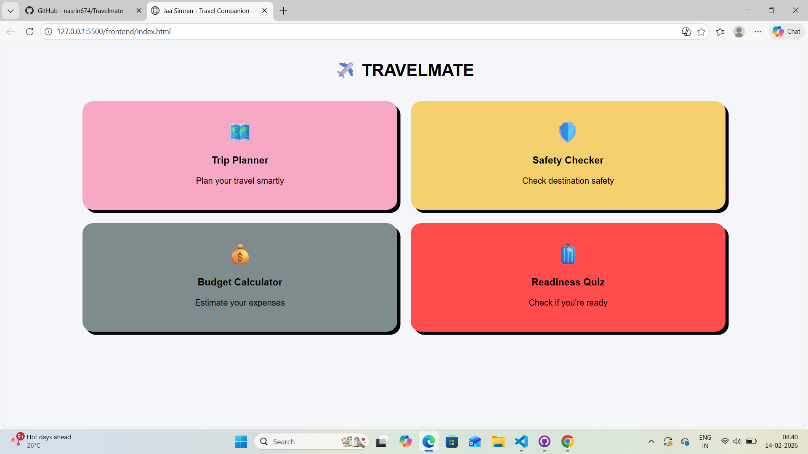
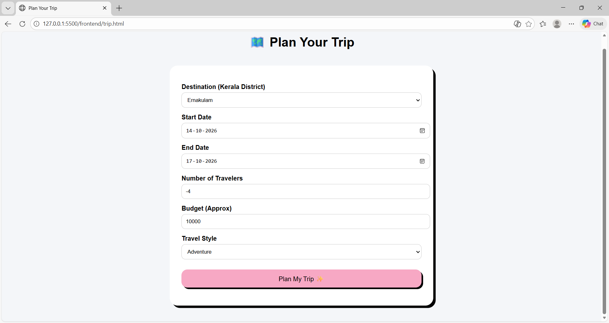
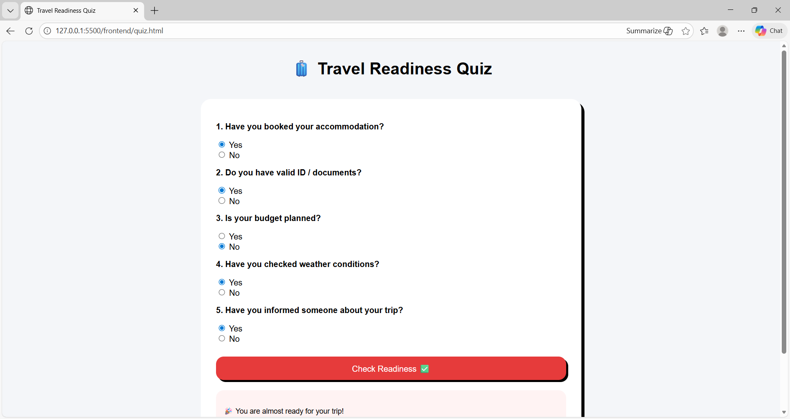

TRAVEL MATE
Basic Details
Team Name: Code Icons
Team Members:
Member 1: Farsana Shemeer - [Ilahia College of Engineering and Technology]
Member 2: [Fathima Nasrin M M] - [Ilahia College of Engineering and Technology]
Hosted Project Link:
[https://github.com/nasrin674/Travelmate.git]
Project Description:
Travel Mate is a modular travel companion web application that helps users plan trips, calculate budgets, check destination safety, and assess their travel readiness—all in a single platform. Users can customize trips for Kerala districts based on preferences and get dynamic travel suggestions.

The Problem Statement:-
Planning a trip can be confusing and stressful, especially when trying to manage:
Budget constraints
Safety concerns of destinations
Travel schedules
Readiness for travel tasks
Most existing tools are either incomplete or scattered across multiple platforms.

The Solution
Travel Mate / Jaa Simran solves this problem by providing:
A Trip Planner to generate sample itineraries
A Safety Checker for each destination
A Budget Calculator for trip expenses
A Travel Readiness Quiz to ensure users are prepared
All modules are integrated in a single web app with easy navigation.

Technical Details
Technologies/Components Used
Software:
Languages used: JavaScript, HTML, CSS, Node.js
Frameworks used: Express.js (Backend)
Libraries used: CORS, fs (Node file system module)
Tools used: VS Code, Node.js, npm

Features
Feature 1: 🗺️ Trip Planner – Generate sample itineraries based on destination, travel style, budget, and number of travelers
Feature 2: 🛡️ Safety Checker – Check safety status for Kerala districts before planning your trip
Feature 3: 💰 Budget Calculator – Calculate total budget and daily spending suggestions
Feature 4: 🧳 Travel Readiness Quiz – Check readiness before traveling with a simple questionnaire.
 
PROJECT DOCUMENTATION
For Software:
Screenshots

*Shows the homepage with 4 main functionalities.*

*Shows the Trip Planner page with form inputs.*

*Shows the Travel Readiness Quiz module.*

## Diagrams

### System Architecture

*This diagram illustrates the system architecture of Travel Mate, showing the frontend, backend, modules, and data flow.*

### Application Workflow

*This diagram explains the step-by-step workflow of Travel Mate, from user input on the frontend to backend processing and result display.*